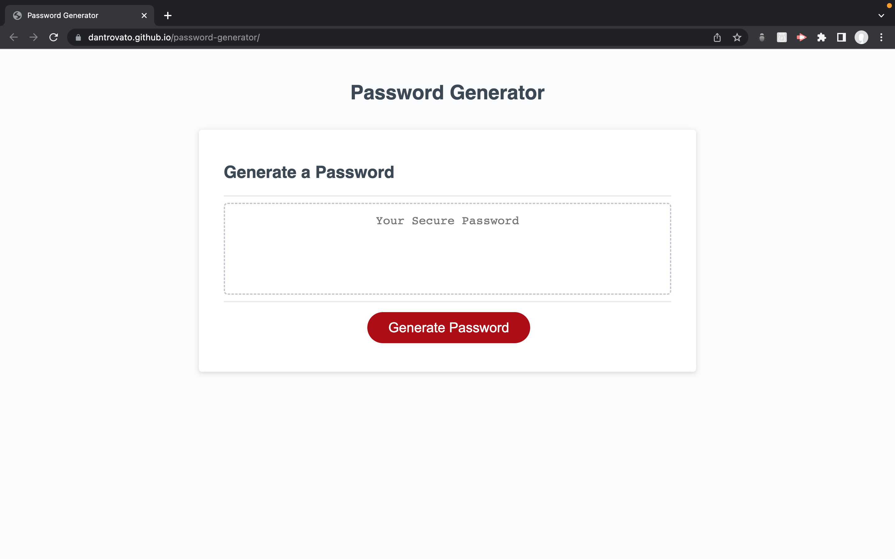
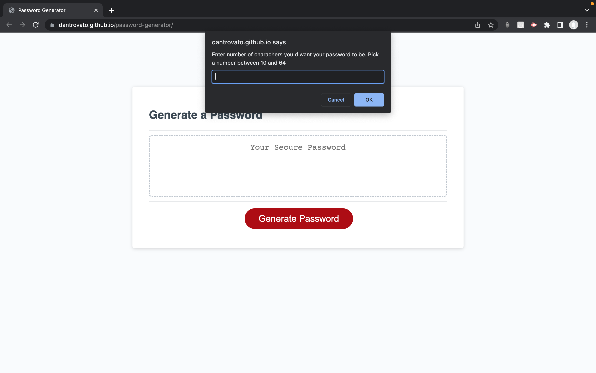
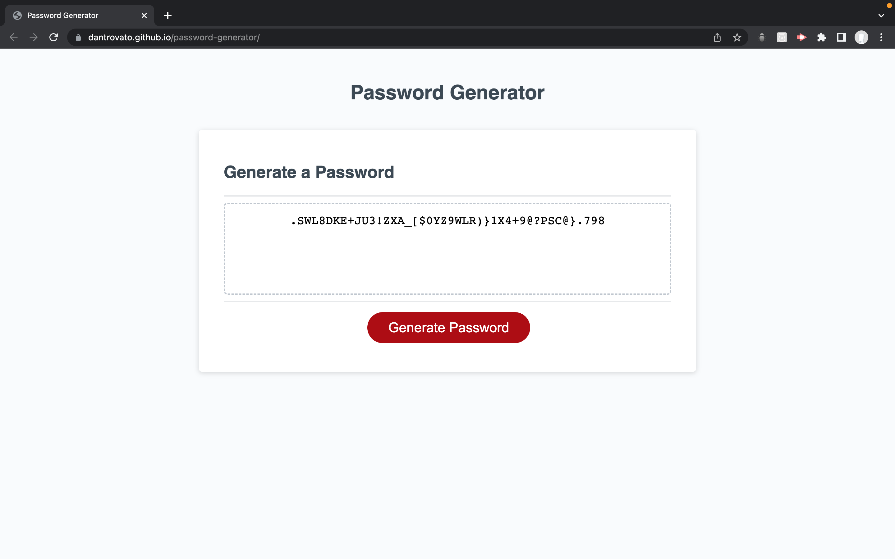

# Password Generator

<!-- ABOUT THE PROJECT -->

### The page at the start

### The page as it collects inputs from user

### The expected result

## About The Project

This is a simple password generator. All a user does is click the only button on the page and then answer prompts as to the length of the password and the type of characters it should include. The code goes beyond the happy path and resubmits the prompts if the user doesn't enter the expected choices.

### Built With

Vanilla Javascript, CSS and HTML

## License

N/A

<!-- CONTACT -->

## Contact

Your Name - [linkedIn](https://www.linkedin.com/in/daniele-trovato-6a130718a/) - dantrovato@gmail.com

Project Link: [https://github.com/your_username/repo_name](https://github.com/your_username/repo_name)

<!-- ACKNOWLEDGEMENTS -->

Thank you to Andrew at Trilogy Bootcamp for the tips
